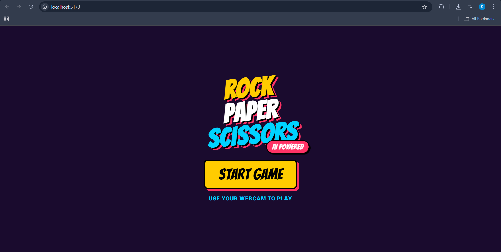
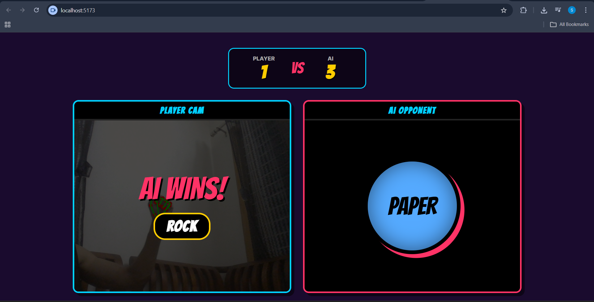
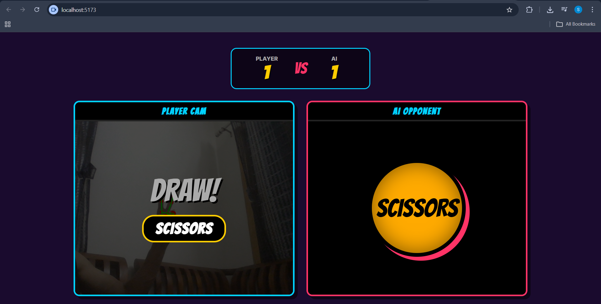
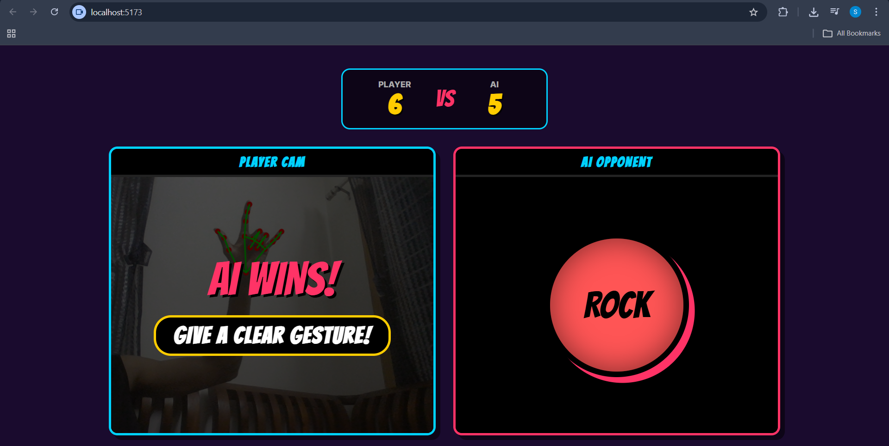

# AI Rock Paper Scissors (Camera-Based)


> A browser-native computer vision project combining WebAssembly, React state orchestration, and real-time gesture recognition.

A production-grade React + Vite web application that allows users to play Rock Paper Scissors using real-time webcam hand gesture detection.

The application uses Google MediaPipe Tasks Vision to perform on-device frame analysis, detecting and identifying hand landmarks to derive gestures (Rock, Paper, or Scissors) and compete against an AI opponent in a retro arcade-style interface.

---

## 🚀 Live Demo

*(yet to be deployed)*

---

## 🎯 Core Features

- Real-Time Webcam Tracking using WebRTC (`getUserMedia`)
- MediaPipe HandLandmarker Integration via WebAssembly (WASM)
- Gesture Detection Engine using geometric landmark comparison
- AI Opponent with automated round lifecycle
- Arcade Interface with animated overlays and synchronized 3–2–1 countdown
- Auto-reset round system with strict memory cleanup
- Proper React lifecycle management and `cancelAnimationFrame` safeguards

---

## 🧠 Technical Implementation

### Hand Landmark Detection (MediaPipe Tasks Vision)

The application leverages `@mediapipe/tasks-vision`, which runs entirely in the browser using WebAssembly.  
The `HandLandmarker` model processes the `<video>` stream and outputs 21 3D hand landmarks per frame.

No server-side inference is required.

---

### Video–Canvas Synchronization

An HTML5 `<canvas>` is stacked over the `<video>` element to render joints and connection lines.

To prevent coordinate misalignment:
- `canvas.width` and `canvas.height` are dynamically synced to  
- `video.videoWidth` and `video.videoHeight`

This ensures correct overlay mapping regardless of viewport scaling.

---

### Gesture Detection Logic

Gesture classification is derived from landmark geometry:

- **ROCK** → All fingers folded (Tip Y > PIP Y)
- **PAPER** → All fingers extended (Tip Y < PIP Y)
- **SCISSORS** → Index + Middle extended, Ring + Pinky folded

Finger extension is calculated by comparing fingertip landmarks against their corresponding PIP joints.

---

### Game State Architecture

The game follows a controlled React state cycle:

```
landing → countdown → detecting → result → countdown
```

During the countdown phase:
- AI randomly selects from `['ROCK', 'PAPER', 'SCISSORS']`
- User gesture is captured
- Winner is computed
- Score is updated
- Next round begins automatically

---

## 🏗 Tech Stack

- React (Functional Components + Hooks)
- Vite (Build Tooling)
- MediaPipe Tasks Vision (Computer Vision)
- JavaScript (ES6+)
- HTML5 Canvas + `<video>`
- WebRTC (MediaDevices API)
- requestAnimationFrame (Frame Loop Control)

---

## 📂 Project Structure

```
src/
├── components/
│   ├── LandingScreen.jsx
│   ├── RPSArcadeGame.jsx
│   └── WebcamScanner.jsx
├── hooks/
│   └── useHandTracking.js
├── App.jsx
├── main.jsx
└── index.css
```

---

## 📸 Screenshots

<p align="center">
  
</p>

<p align="center">
  
</p>

<p align="center">
  
</p>

<p align="center">
  
</p>

---

## 🧩 Requirements

- Node.js v18+
- Modern browser with webcam support
- HTTPS required for camera access (except `localhost`)

---

## ⚙️ Installation

```bash
# Clone the repository
git clone https://github.com/Sankethhhhhhh/rock-paper-scissors.git

# Navigate into the project directory
cd rock-paper-scissors

# Install dependencies
npm install

# Start development server
npm run dev
```

---

## 🏭 Production Build

```bash
npm run build
```

---

## 🌐 Deployment

The application can be deployed on Netlify or Vercel.

⚠️ Browsers require **HTTPS** for webcam access.  
The `getUserMedia` API will not work over unsecured HTTP (except on `localhost`).

---

## 🛠 Challenges & Learnings

- Managing asynchronous WASM loading and React lifecycle synchronization
- Solving canvas/video resolution mismatch
- Designing gesture logic without over-engineering vector math
- Preventing memory leaks via explicit `track.stop()` and `landmarker.close()` cleanup
- Handling Strict Mode re-mount behavior safely

---

## 📈 Future Improvements

- Adaptive AI using Markov chains or frequency-based prediction
- Confidence score visualization
- Session analytics dashboard
- Multiplayer via WebSockets
- Progressive Web App (PWA) support

---

## 👨‍💻 Author

**Built by Sanketh**  
AIML Student  
Focused on AI-driven interactive systems and production-ready machine learning web interfaces.

---

## 📄 License

This project is licensed under the MIT License.
